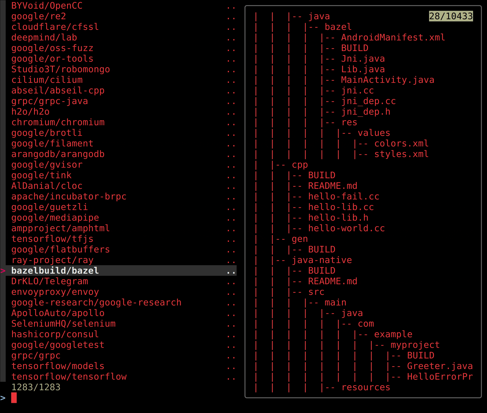

Repository structure analysis of projects utilizing rules_cc



You can use sq + fzf to preview project structures. Use 'j' and 'k' keys to scroll through listing of a selected project.
```
sq sql "SELECT name, MAX(stars) as stars, forks, issues, description, url FROM data GROUP BY md5sum ORDER BY stars desc" --opts header=true  <<< $(cat results.csv) | tail -n +2 | fzf --preview='cat repos/{1}/tree.txt'  --bind k:preview-up,j:preview-down | tr -s " " | rev | cut -d" " -f2 | rev
``` 

To reproduce contents of this repository, see `cc_users.bigquery` and `gh_query.sh`.
